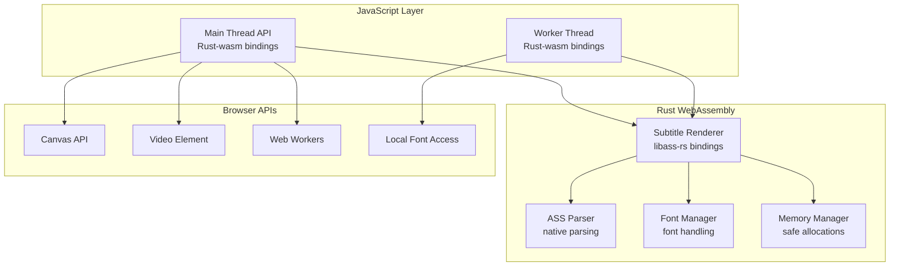

# Rust JASSUB Implementation Roadmap

This roadmap outlines the complete recreation of JASSUB (JavaScript SSA/ASS Subtitle Renderer) in Rust, maintaining feature parity with the original JavaScript/WebAssembly implementation.

## Project Overview

JASSUB is a high-performance subtitle renderer that uses libass to render SSA/ASS subtitles in web browsers through WebAssembly and Web Workers . The Rust implementation will replicate this architecture while leveraging Rust's safety guarantees and performance characteristics.

## Architecture Specification

### Core Components

## Phase 1: Foundation and Core Rendering (Weeks 1-4)

### 1.1 Project Setup
- [ ] Initialize Rust library project with `wasm-pack` template
- [ ] Set up build pipeline for WebAssembly compilation
- [ ] Configure TypeScript bindings generation
- [ ] Establish basic project structure

### 1.2 Core Data Structures
- [ ] Implement ASS event and style structures 
- [ ] Create font management structures
- [ ] Define rendering result types
- [ ] Implement memory-safe buffer management

### 1.3 Basic libass Integration
- [ ] Research and integrate `libass-rs` or create FFI bindings
- [ ] Implement basic renderer initialization 
- [ ] Create track loading functionality 
- [ ] Implement basic rendering pipeline

### 1.4 WebAssembly Interface
- [ ] Create WASM bindings for core functions
- [ ] Implement memory management across JS/WASM boundary
- [ ] Set up error handling and logging
- [ ] Create basic JavaScript API wrapper

## Phase 2: Advanced Rendering Features (Weeks 5-8)

### 2.1 Rendering Modes
- [ ] Implement async rendering with `createImageBitmap` 
- [ ] Add offscreen canvas support 
- [ ] Implement blend mode selection (JS vs WASM) 
- [ ] Add hybrid rendering modes

### 2.2 Performance Optimizations
- [ ] Implement SIMD detection and utilization 
- [ ] Add animation dropping functionality 
- [ ] Implement blur effect optimization 
- [ ] Create efficient memory reuse system 

### 2.3 Canvas and Video Integration
- [ ] Implement canvas resizing and management 
- [ ] Add video synchronization logic
- [ ] Implement frame timing control
- [ ] Add color space handling

## Phase 3: Font Management (Weeks 9-10)

### 3.1 Font Loading System
- [ ] Implement font loading from URLs and arrays 
- [ ] Create available fonts registry 
- [ ] Add fallback font system 
- [ ] Implement local font access integration 

### 3.2 Font Processing
- [ ] Add font format validation
- [ ] Implement font caching strategies
- [ ] Create font memory management
- [ ] Add font fallback logic

## Phase 4: Worker Thread Architecture (Weeks 11-12)

### 4.1 Worker Communication
- [ ] Implement message-based communication protocol 
- [ ] Create worker initialization flow 
- [ ] Add error handling and recovery
- [ ] Implement worker lifecycle management

### 4.2 Rendering Pipeline
- [ ] Create render loop management 
- [ ] Implement on-demand rendering 
- [ ] Add frame synchronization
- [ ] Create performance monitoring

## Phase 5: API and Integration (Weeks 13-14)

### 5.1 JavaScript API
- [ ] Implement main JASSUB class interface 
- [ ] Add all configuration options 
- [ ] Implement event handling system
- [ ] Create comprehensive error handling

### 5.2 Method Implementation
- [ ] Add subtitle track management methods 
- [ ] Implement event/style manipulation 
- [ ] Add font management methods 
- [ ] Create cleanup and destruction methods 

## Phase 6: Testing and Optimization (Weeks 15-16)

### 6.1 Comprehensive Testing
- [ ] Create unit tests for all Rust components
- [ ] Add integration tests for WebAssembly interface
- [ ] Implement browser compatibility testing
- [ ] Create performance benchmarks

### 6.2 Final Optimization
- [ ] Profile and optimize memory usage
- [ ] Fine-tune rendering performance
- [ ] Optimize WebAssembly binary size
- [ ] Add final error handling improvements

## Technical Specifications

### Memory Management
- Use Rust's ownership system for safe memory management
- Implement custom allocators for WebAssembly heap
- Create buffer reuse system similar to `ReusableBuffer` 
- Manage memory limits for libass caches 

### Performance Targets
- Maintain parity with original performance characteristics
- Target < 10ms render time for typical subtitle frames
- Support 4K resolution rendering
- Maintain 60fps rendering capability

### Browser Compatibility
- Support modern browsers with WebAssembly
- Graceful fallback for older browsers
- Maintain feature detection system 
- Support both ES modules and UMD builds

## Deliverables

1. **Core Rust Library**: Complete WebAssembly-compiled subtitle renderer
2. **JavaScript Bindings**: TypeScript definitions and API wrapper
3. **Documentation**: Comprehensive API documentation and usage examples
4. **Test Suite**: Full test coverage including browser tests
5. **Build System**: Automated build and release pipeline
6. **Performance Benchmarks**: Comparison with original implementation

## Success Criteria

- [ ] 100% API compatibility with original JASSUB
- [ ] Performance within 10% of original implementation
- [ ] All major browsers supported
- [ ] Memory usage optimized for embedded devices
- [ ] Comprehensive test coverage (>90%)
- [ ] Full documentation and examples

---

## Notes

This roadmap assumes familiarity with the original JASSUB architecture and focuses on recreating its functionality in Rust. The implementation should prioritize safety and performance while maintaining the exact API surface for drop-in compatibility. Key technical challenges include WebAssembly memory management, browser API integration, and maintaining real-time rendering performance.

Wiki pages you might want to explore:
- [Getting Started (ThaUnknown/jassub)](/wiki/ThaUnknown/jassub#2)
- [Architecture (ThaUnknown/jassub)](/wiki/ThaUnknown/jassub#3)
- [Performance Optimizations (ThaUnknown/jassub)](/wiki/ThaUnknown/jassub#3.3)
